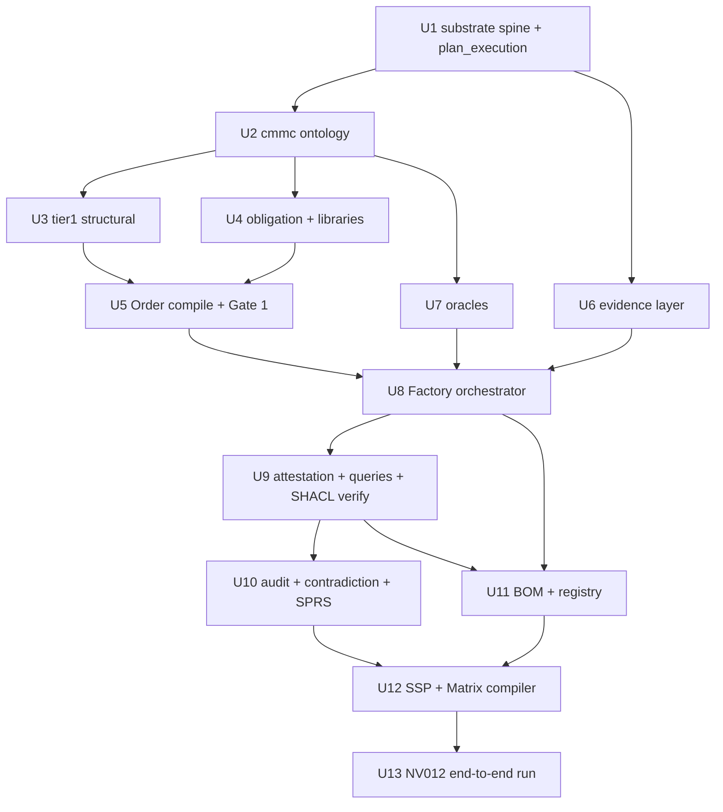

# feat: NV012 Compliance Engine — compile the Order, build the BOM + SSP (software)

**Target repo:** `compliance-engine/` (this design repo). Ports reference the read-only sibling repo `ADCS-lifecycle-demo/` — paths prefixed `ADCS-lifecycle-demo/…` are source to port from, never modified.

## Overview

Build the **software system** that takes NV012 from 0→100 the way we designed it: an **Order Compiler** turns the contract into a signed, proof-carrying Order, and a **Factory** executes that Order to produce a hash-referenced BOM, a deterministic SSP, the generated Traceability Matrix (Document 2), and a computed SPRS score — by **porting the ADCS traceability substrate** and adding the CMMC front-half ADCS lacks.

Honest framing (sharpened during deepening): the engine makes the **machine-checkable subset** of controls a provisioning artifact, and makes the **human-attested remainder** (policy/training/process controls — a large tail of the 110) auditable and drift-checked. It is not "compliance = a provisioning artifact" unqualified.

Per the agreed scope, provisioning is **mocked-then-real-ready**: the Factory is real, the Terraform/cloud calls sit behind a frozen `ProvisionBackend` interface so the loop runs end-to-end and emits a BOM + SSP from fixture evidence. Live `terraform apply` and the actual SPRS/PIEE submission are **explicit follow-up work**.

> **Deepening (2026-07-02):** integrated four review bundles — correctness/sequencing fixes (keep SysML; Gate 1 gets its own queries; dependency reorder), FCA safety guardrails (contradiction detector R13; non-evidentiary mock marker R12), honesty/framing (thesis scoped to the machine-checkable subset; "signed"→"hash-referenced"), and scope trims (OBL-IL5 handler, two-level registry, deferred capabilities renamed). U-IDs are unchanged.

---

## Problem Frame

NV012 (DLA SBIR, AI vendor economic-dependency tool) requires **CMMC Level 2 (Self-Attestation) before award** (Q36; DFARS 252.204-7025(b)(1), 7021(d)) for the information system DSG uses to handle CUI. Today DSG has one Google Workspace tenant, no CUI boundary, and **all 110 controls are "Planned"** — proof is manual, scattered, and goes stale on any change.

The system we designed makes the machine-checkable subset a *provisioning artifact* and gives the rest a rigorous, drift-checked audit substrate. This plan builds enough of that system, in software, to **compile NV012's Order and produce its BOM + SSP + SPRS score** — a real, re-runnable spine before the (separate) live provisioning and SPRS submission. (see origin: `reference/requirements/cats-compliance-engine-requirements.md`; design: `reference/concepts/adcs-to-cmmc-compliance-engine.md`)

---

## Requirements Trace

- R1. NV012's Order is **compiled from the contract** (not hand-authored), via a human-attested Contract Obligation Profile (COP). (origin §2, §7.2)
- R2. **Gate 1 (planning coverage):** the Order emits only if every required control has ≥1 claiming module, every module traces to a required control, and no claim lacks a testable method. (design §2)
- R3. The **Factory executes an Order end-to-end** with mocked provisioning + fixture evidence, producing a BOM. (origin §7.2, §8.3)
- R4. A control is **MET only when its evidence passes AND a human attests** (Gate 2); controls with no machine-checkable criterion resolve to `cantTell` → human-only. (origin §8.6; ADCS core principle)
- R5. **Bidirectional audit** runs against the Order's required-control set; every promised control returns MET or the BOM is non-compliant. (origin §8.6; design §2)
- R6. Compute the **SPRS score** (110 baseline, weight deductions) and **hard-fail illegal POA&M** (any 3-/5-point control deferred). (32 CFR §170.21/170.24)
- R7. Compile a **deterministic, drift-checked SSP** and the **generated Traceability Matrix (Document 2)** from the graph. (origin §2, §8.5)
- R8. Content-address every artifact with **SHA-256 in a local write-once registry** (no IPFS); the BOM references all artifacts by hash. (origin §5, §16.2)
- R9. **Reuse the ADCS substrate by porting** it (not reimplementing). (origin §5.2)
- R10. Encode **all 110 controls** from Document 1 with weights + POA&M eligibility. (Document 1)
- R11. **Separate environment obligations** (drive the Order) from **deliverable obligations** (tagged, not provisioned) — as an explicit, attested COP classification, not a silent rule. (NV012 brief §1 vs §2)
- R12. **Non-evidentiary marker (deepening):** any artifact whose provenance includes a mock backend or an auto-attestation carries a propagating `ce:evidentiaryStatus "mock"`; the SSP build **refuses to omit** it (renders a NON-EVIDENTIARY banner). A mock BOM/SSP must never be mistakable for a submittable one.
- R13. **Contradiction detector (deepening):** the audit surfaces every MET attestation whose backing oracle returned `failed`/absent (requires a recorded override justification), and reports the split of MET-by-machine-evidence vs MET-by-human-only (`cantTell`) as a first-class metric.

---

## Scope Boundaries

- **Not** running live `terraform apply` against GCP/Workspace — provisioning is mocked behind a frozen interface.
- **Not** submitting to SPRS/PIEE or performing affirmation — the system computes the score; a human submits it separately.
- **Not** Tier 2 (IL5 / ITAR / Azure Gov / GCC High) — NV012 Phase I is offeror-hosted IL4/Tier 1 (Q53). Tier 2 is designed-for, not built.
- **Not** building the NV012 *deliverable* (the SFFAS 47 tool) — a separate product.
- **Not** production signing (Sigstore cosign / Rekor) — bare SHA-256 content-addressing now; authenticity deferred. The plan uses "hash-referenced," not "signed," to avoid overstating a checksum.
- **Not** the GitHub PR/OIDC approval automation — the approval gate is modeled as a step; real wiring deferred.

**Known guarantees this plan does NOT provide (state, don't hide):**
- The "compliance is a provisioning artifact" property holds only for the **machine-checkable subset**; the process/policy tail stays human-attested.
- Gate 1 guarantees **no silent gaps** in the derivation chain — not the *semantic correctness* of each obligation→control→module→criterion link. Those links are hand-authored in `tier1.ttl`/`criteria.py`, machine-unverified until the human Gate 2 call.
- The environment-vs-deliverable split is a **human classification**; neither gate can catch a mis-classification (a deliverable that silently drops an environment control). Mitigated by an explicit attested decision + a CUI/ITAR-spillover guard (U4/U5).

### Deferred to Follow-Up Work

- Real Terraform provisioning + live evidence collectors (swap the mock `ProvisionBackend` for the real one).
- Reproducibility `/verify` against live infra (`ADCS-lifecycle-demo/compute/reproduce.py` retargeted to Terraform).
- Sigstore cosign/Rekor signing; GCS/Azure Blob registry backends; GitHub OIDC approval gate.
- Multi-BOM registry index (`control_id → BOMs claiming MET`); multi-contract clause extraction.
- SPRS submission workflow + affirmation; C3PAO readiness.

---

## Context & Research

### Relevant Code and Patterns (ADCS reuse map — corrected during deepening)

Source under `ADCS-lifecycle-demo/`. Verdicts recalibrated where reviewers found "port as-is" too optimistic:

| Capability | Source | Verdict (corrected) |
|---|---|---|
| Content hashing | `evidence/hashing.py` | **port as-is** (`hash_structural_model`, `hash_evidence`, `_serialize_for_hash`) |
| Evidence binding | `evidence/binding.py` | **adapt (heavier than it looks)** — `_bind_execution_metadata` is driven by a compute type we drop; **rewrite** it against a new CMMC `CollectionMetadata` struct |
| Human attestation | `traceability/attestation.py` | **port as-is** structure/EARL/GSN; adapt prompts; note it imports `traceability/queries.py` (create in U9) |
| Bidirectional audit | `traceability/audit.py` | **port dataclasses/render/emit, dropping Docker dead-code** (`DockerProvenanceRow`, `_DOCKER_PROVENANCE_Q`, `docker_provenance()`, the field + md section); adapt SPARQL to CMMC IRIs. **Does NOT serve Gate 1** (wrong query shape). |
| Orchestrator | `pipeline/runner.py`, `pipeline/state.py` | **structural pattern only** (thread state, emit `p-plan:Activity`/stage, Typer shell, fail-fast preflight); preflight probes **provision + store**, not compute |
| Plan-execution model | `traceability/plan_execution.py` | **port as-is but lands in U1** (domain-agnostic); `STEP_NAMES` ↔ `plan.ttl` ↔ `state.activity_to_stage` must enumerate the identical Factory stage set |
| Backends + preflight | `pipeline/backends/{base,local,fuseki}.py` | **port as-is** (drop flexo/txnlog) |
| Deterministic doc compiler | `documents/design_description.py` | **port as-is** determinism/`--check`/fingerprint; adapt sections + queries |
| Ontology build | `scripts/build_ontology.py` | **adapt (~220 LOC, not 375)** — drop `_load_sysml_term_map`/`_verify_sysml_axioms`/OSLC imports/equivalence-axiom counting; keep budget gate, reproducible time, `_validate_references` (remaining imports), manifest; recalibrate `TRIPLE_BUDGET` for 110 controls; one-time `fetch_imports` (network) to vendor `ontology/imports/` |
| Behavior oracle | `analysis/oracle.py`, `traceability/oracle_assertion.py` | **port as-is** engine; adapt criteria; make metric typing accept **boolean/string**, not decimal-only |
| SHACL suite + verify | `ontology/rtm_shapes.ttl`, `traceability/verification.py` | verify wrapper **port as-is**; shapes **adapt** (drop Docker/Org/Txnlog) |
| Dataset helpers + prefixes | `pipeline/dataset.py`, `ontology/prefixes.py` | dataset **port as-is** (`create_dataset()` — `default_union=True` is hardcoded inside, not a param); prefixes **adapt** — **keep `sysml:`**, retarget instance IRIs `rtm:`/`adcs:`/`sat:` → `cmmc:`/`ce:` |
| Typer CLI convention | (all CLIs), `tests/test_cli.py` | **port as-is** |

Test templates to port: `tests/test_audit.py` (18), `tests/test_backends.py` (27), `tests/test_shape_suite.py` (13), `tests/test_design_description.py` (15), `tests/test_oracle.py` (15, oracle≠attestation regression), `tests/test_attestation_gsn.py` (9).

### Institutional Learnings / Research Briefs

- **NV012 obligations:** Environment = CMMC L2 self-attest before award (Q36), **IL4/Tier 1 for Phase I** (Q53; IL5 = Phase II), ITAR/US-person, CUI + FedRAMP-Mod CSP (DFARS 7012). Deliverable obligations (SFFAS 47 tool, incl. the Q42/Q44 vendor self-reporting portal) are **separate — but can spill environment controls if they touch CUI/ITAR data on DSG infra** (see U4 guard).
- **Tier 1 control mapping (brief §3):** the 5-day buildout maps resources → controls (MFA→IA.L2-3.5.3; CMEK/CSE→SC.L2-3.13.11/16; IAM groups→AC.L2-3.1.1/2; log export→AU.L2-3.3.1/2; org policy US-region→SC.L2-3.13.1 + ITAR residency; DLP→AC.L2-3.1.3). Seed for `structural/tier1.ttl`. **These tags are hand-authored and machine-unverified** (Gate 1 checks presence, not correctness).
- **SPRS rules (brief §4):** 110 baseline; 88 conditional floor; only 1-point controls POA&M-eligible; six excluded (AC.L2-3.1.20/3.1.22, CA.L2-3.12.4, PE.L2-3.10.3/4/5); **63 vs 64 non-deferrable discrepancy** — reconcile before relying on it.
- **Catalog state:** all 110 "Planned"; weights 42×5, 14×3, 52×1, 2 variable (IA.L2-3.5.3, SC.L2-3.13.11).

### External References

- No external framework research needed: stack is `rdflib`/`pyshacl`/`typer` (ADCS-proven) + Terraform (mocked). NIST/DoD/ITAR grounding is under `reference/guides/` and `reference/standards/`.

---

## Key Technical Decisions

- **Port, don't import.** New package mirroring ADCS; copy + adapt rather than depend, so we drop the satellite/SymPy/SciPy deps and stay self-contained. (origin §5.2)
- **Keep SysML as the structural/requirement vocab.** `cmmc:Control ⊑ sysml:RequirementDefinition`; modules are `sysml:PartUsage` with satisfy edges (matches the existing scaffold + ADCS audit queries). Retarget only the **instance** namespaces `rtm:`/`adcs:`/`sat:` → `cmmc:`/`ce:`, and keep `prov:`/`earl:`/`gsn:`/`p-plan:`/`sh:`. (Reverses the earlier "drop SysML" note, which contradicted the scaffold.)
- **Real Factory, mocked infra — with a frozen seam.** U8 defines the `ProvisionBackend` data contract: the `plan()`/`apply()` return schema and a stable `resource_id` that (a) matches a `tier1.ttl` module, (b) is what evidence references, (c) appears in the BOM control-mapping. A conformance test pins the mock output to that schema so the real backend is a genuine drop-in. This is what keeps "mocked→real" a one-file swap.
- **Two gates, shared report structure, gate-specific queries.** Gate 1 (Compiler, control↔module) and Gate 2 (Factory, control↔evidence↔attestation) reuse the audit *dataclasses/render*, but each writes its own forward/backward SPARQL — they are different graph shapes.
- **Bare SHA-256 = content-addressing, not signing.** Artifacts are hash-referenced and tamper-evident only within the write-once registry's trust boundary. Cryptographic non-repudiation (Sigstore/Rekor) is deferred; the plan avoids the word "signed."
- **Mock provenance is indelible.** `ce:evidentiaryStatus "mock"` propagates mock-provision → mock-evidence → BOM → SSP; the SSP compiler cannot omit the banner. (R12)
- **`cantTell` is load-bearing, and MET-over-failed-oracle is surfaced.** Oracles return `cantTell` where no criterion exists (never auto-pass); and because MET is a human call not gated on the oracle, the audit explicitly flags any MET that contradicts a `failed` oracle. (R13)

---

## Open Questions

### Resolved During Planning
- Reuse strategy: **port** into a self-contained package.
- Vocab: **keep SysML**; retarget instance namespaces only.
- Provisioning: **mocked behind a frozen `ProvisionBackend`**; live apply deferred.
- Signing: **bare SHA-256 content-addressing**; Sigstore later.
- Registry: **local write-once**, two-level index; GCS/Azure deferred.
- Tier scope: **Tier 1 / IL4 only**.

### Deferred to Implementation
- Exact `cmmc:`/`ce:` instance-predicate names (settle when adapting `prefixes.py`).
- Precise fixture shapes per generator + the `ProvisionBackend` plan/state schema (settle in U6/U8 against a real export sample).
- Which controls are machine-checkable vs `cantTell` — start with the 5-point + Tier 1-mapped set; expand.
- **63-vs-64 non-deferrable reconciliation** — needs the compliance lead to confirm against 32 CFR §170.21 before the POA&M-legality gate's *verdict* is trustworthy (mechanism is built regardless).
- **`tier1.ttl` control→module mapping review sign-off** — the mapping is load-bearing and machine-unverified; consider an explicit human review of the mapping table (separate from Gate 2 per-control attestation).

---

## Output Structure

    compliance-engine/
      pyproject.toml                # U1  deps (rdflib/pyshacl/typer/httpx/pydantic); no sympy/scipy
      ontology/
        cmmc-edit.ttl              # U2  Document 1 as TBox (110 controls + weights + POA&M)
        cmmc_shapes.ttl            # U2  SHACL: ControlShape, PoamLegalityShape, ContradictionShape, Attestation/Evidence/Traceability
        prefixes.py                # U1  keep sysml:; cmmc:/ce: instance IRIs + named-graph IRIs
        imports/                   # U2  vendored upstream TTLs (prov/earl/ontogsn/p-plan/shacl) via fetch_imports
      scripts/
        build_ontology.py          # U2  adapted build (budget/manifest; SysML term-map + OSLC dropped)
      structural/
        tier1.ttl                  # U3  module ↔ control allocation (hand-authored; review sign-off deferred)
      order-compiler/              # front-half (separate tool)
        obligations.ttl            # U4  COP vocab + NV012 example (OBL-IL5 resolves empty for Phase I)
        rule_library.py            # U4  obligation → required control set (+ CUI/ITAR spillover guard)
        clause_library.py          # U4  DFARS/ITAR clause → obligation (authoring-time completeness check)
        cop.py                     # U5  COP build + human attestation (per-deliverable "no env control" affirmation)
        compiler.py                # U5  resolve controls→modules, emit hash-referenced Order
        gate1.py                   # U5  planning-coverage audit (own SPARQL; reuses audit dataclasses)
      evidence/
        hashing.py                 # U6  ported SHA-256 hasher (+ CMMC helpers)
        binding.py                 # U6  evidence→graph binding; _bind_execution_metadata rewritten to CollectionMetadata
        generators/                # U6  mocked config-export / policy-check generators (carry evidentiaryStatus)
      oracles/
        criteria.py                # U7  control → machine criterion (boolean/string/numeric)
        assertion.py               # U7  EARL ControlCheckAssertion emitter
      pipeline/
        dataset.py                 # U1  named-graph helpers (ported)
        prefixes.py → ontology/    #     (prefixes live under ontology/)
        plan_execution.py          # U1  CMMC step model (ported; STEP_NAMES ↔ plan.ttl ↔ state)
        state.py                   # U8  PipelineState + frozen stage results (collects raw results; no bom.py here)
        plan.ttl                   # U8  Factory SOP (step SignAndStore, not SignStore)
        runner.py                  # U8  Factory orchestrator (Order → PipelineState)
        provision/mock_terraform.py# U8  ProvisionBackend impl behind the frozen schema
        registry.py                # U11 write-once, two-level index
        backends/{base,local}.py   # U1  registry backends (ported)
      traceability/
        queries.py                 # U9  shared SPARQL (imported by attestation.py + documents/)
        attestation.py             # U9  Gate 2 human attestation (ported)
        verification.py            # U9  SHACL verify wrapper (ported)
        audit.py                   # U10 bidirectional audit (Docker dead-code dropped) + contradiction dimension
        sprs.py                    # U10 SPRS score + POA&M legality
        bom.py                     # U11 BOM assembly + hash-reference (created here, not U8)
      documents/
        ssp.py                     # U12 deterministic SSP + Matrix compiler (non-evidentiary banner)
      tests/                       # one test module per engine module (ported templates)
      fixtures/nv012/              # sample evidence exports for the mocked run

---

## High-Level Technical Design

> *This illustrates the intended approach and is directional guidance for review, not implementation specification.*

Two systems, one hash-referenced Order file across the seam:

```
CONTRACT (reference/contracts/NV012*)                         [Order Compiler — separate tool]
  → clause_library: clause → obligations (authoring-time completeness)
  → cop.py: COP; HUMAN ATTESTS (+ per-deliverable "no env control" affirmation)  → <ce:order>
  → rule_library: obligation → required controls (deliverable+CUI/ITAR ⇒ spillover flag, not silent {})
  → compiler.py: required control → claiming module (structural/tier1.ttl)
  → gate1.py: forward+backward over satisfy edges (own SPARQL; audit dataclasses)  ── fail ⇒ no Order
  → hash-referenced ORDER file  ─────────────────────────────────────────────────┐
                                                                                  │  seam: frozen
[Factory — pipeline/runner.py]  ◄────────────────────────────────────────────────┘  ProvisionBackend schema
  0 load+verify Order          4 evidence/generators (mock, carry evidentiaryStatus) → <ce:evidence>
  1 fetch modules by hash      5 oracles/criteria → EARL ControlCheckAssertion (cantTell if none)
  2 mock_terraform plan        6 collect raw results into PipelineState (no bom.py yet)
  3 policy-as-code (oracles)   7 attestation.py: HUMAN MET/NOT MET  [Gate 2]
     fail ⇒ stop before apply  7a audit.py: vs Order's required set + CONTRADICTION dimension; sprs.py score/POA&M
  4 mock_terraform apply       8 bom.py: assemble + hash-reference + registry;
                                  ssp.py compiles SSP + Matrix (NON-EVIDENTIARY banner when mock)
```

Unit dependency graph:



---

## Implementation Units

### Phase 1 — Substrate & Ontology (the reusable spine)

- [ ] U1. **Substrate spine (port the ADCS plumbing)**

**Goal:** Stand up the self-contained package with the domain-agnostic ADCS plumbing: named-graph dataset, namespaces/IRIs, the plan-execution step model, local+base backends with preflight, and the Typer CLI convention.

**Requirements:** R8, R9

**Dependencies:** None

**Files:**
- Create: `pipeline/dataset.py`, `ontology/prefixes.py`, `pipeline/plan_execution.py`, `pipeline/backends/base.py`, `pipeline/backends/local.py`, `pyproject.toml`
- Test: `tests/test_named_graphs.py`, `tests/test_backends.py`, `tests/test_plan_execution.py`

**Approach:**
- Port `ADCS-lifecycle-demo/pipeline/dataset.py` as-is (note: `create_dataset()` hardcodes `default_union=True` internally — not a parameter).
- Adapt `prefixes.py`: **keep `PROV/EARL/GSN/P_PLAN/SH/SYSML`**; retarget `RTM/ADCS/SAT` instance IRIs → `CMMC/CE`; define the 8 named-graph IRIs (`<ce:ontology>`, `<ce:plan>`, `<ce:structural>`, `<ce:order>`, `<ce:evidence>`, `<ce:attestations>`, `<ce:plan-execution>`, `<ce:audit>`).
- Port `plan_execution.py` here (it is domain-agnostic and is imported by `binding.py` in U6): set `STEP_NAMES` to the Factory stages; it must later match `plan.ttl` (U8) and `state.activity_to_stage` (U8).
- Port `backends/base.py` + `local.py` (drop `flexo.py`/`txnlog.py`); keep `probe()` + `get_backend()`.
- `pyproject.toml`: `rdflib`, `pyshacl`, `pydantic`, `typer`, `httpx`; drop `sympy/numpy/scipy/matplotlib`; `addopts = "-m 'not live and not network'"`.

**Execution note:** Port each ADCS test file alongside its module and get it green before adapting — the tests are the porting contract.

**Patterns to follow:** `ADCS-lifecycle-demo/pipeline/dataset.py`, `ontology/prefixes.py`, `traceability/plan_execution.py`, `pipeline/backends/base.py`+`local.py`.

**Test scenarios:**
- Happy path: a Dataset with the 8 named graphs round-trips to TriG and back with identical per-graph counts.
- Happy path: `LocalBackend.persist()` writes union Turtle + TriG; re-read equals written.
- Edge case: `bind_prefixes()` emits `cmmc:`/`ce:` and retains `sysml:`; no leftover `rtm:`/`adcs:`/`sat:` instance IRIs.
- Edge case: `step_iri()` raises on a name outside `STEP_NAMES` (closed-set guard).
- Error path: `LocalBackend.probe()` on a non-writable dir raises `BackendUnavailable`.

**Verification:** the three test modules pass; a scratch script builds an empty 8-graph dataset and persists it.

---

- [ ] U2. **CMMC ontology + build pipeline + SHACL shapes (Document 1 → machine)**

**Goal:** Encode all 110 controls (weights, POA&M eligibility, families, inherited flag) as `cmmc:Control` individuals; build them with the adapted budget/manifest pipeline; add the closure shapes including `PoamLegalityShape` and `ContradictionShape`.

**Requirements:** R6, R9, R10, R13

**Dependencies:** U1

**Files:**
- Create/modify: `ontology/cmmc-edit.ttl`, `ontology/cmmc_shapes.ttl`, `scripts/build_ontology.py`, `ontology/imports/` (vendored)
- Test: `tests/test_ontology_build.py`, `tests/test_ontology_size.py`, `tests/test_ontology_shapes.py`

**Approach:**
- Author `cmmc-edit.ttl` from `reference/control-catalog.md`: `cmmc:Control ⊑ sysml:RequirementDefinition` with `cmmc:controlId`, `cmmc:text`, `cmmc:weight`, `cmmc:poamEligible`, `cmmc:nonDeferrable`, `cmmc:family`, `cmmc:inherited` (PE CSP-inherited). Mark the two variable-weight controls.
- **Adapt** `build_ontology.py` (~220 LOC): drop `_load_sysml_term_map`/`_verify_sysml_axioms`/OSLC-in-VENDORED/`_count_equivalence_axioms` and `build()` Step 2; keep the triple-budget gate (recalibrate `TRIPLE_BUDGET` for 110 controls), `_reproducible_build_time`, `_validate_references` over the remaining imports (treat `cmmc:`/`ce:` as locally-defined), and manifest emission.
- One-time: run `fetch_imports` (network) to populate `ontology/imports/` with `prov/earl/ontogsn/p-plan/shacl`; commit them so build + tests stay offline.
- Adapt shapes from `rtm_shapes.ttl`: keep Attestation/Evidence/Forward+Backward/Provenance/GSN/OutcomeSemantics; add `ControlShape` (id+text+weight+poamEligible), `PoamLegalityShape` (`weight>1` ⇒ no `cmmc:poamItem`), and `ContradictionShape` (a MET attestation whose backing oracle is `failed` and has no `cmmc:overrideJustification` is a violation — R13). Drop Docker/Org/Txnlog shapes.

**Execution note:** Add a data-integrity test asserting exactly 110 controls and the weight histogram {5:42, 3:14, 1:52, variable:2} — catches Document 1 transcription errors.

**Patterns to follow:** `ADCS-lifecycle-demo/scripts/build_ontology.py`, `ontology/rtm_shapes.ttl`, `ontology/rtm-edit.ttl` (structure only).

**Test scenarios:**
- Happy path: build emits `cmmc.ttl` + manifest; reload has exactly 110 `cmmc:Control` nodes.
- Happy path (data integrity): weight histogram matches; every control has id+text+weight+poamEligible.
- Edge case: the six POA&M-excluded 1-point controls carry `nonDeferrable true`.
- Error path (SHACL): `weight 3` + a `cmmc:poamItem` fails `PoamLegalityShape`.
- Error path (SHACL, R13): a MET attestation over a `failed` oracle with no override justification fails `ContradictionShape`.
- Edge case: the budget gate fails the build past `TRIPLE_BUDGET`.

---

- [ ] U3. **Tier 1 structural model (module ↔ control allocation)**

**Goal:** Model Tier 1/IL4 resources as `sysml:PartUsage` design elements, each declaring the controls it satisfies and a verification method — the module set the Compiler resolves against, and the seed for the proven-vs-attested coverage metric.

**Requirements:** R2, R7, R10

**Dependencies:** U2

**Files:**
- Modify: `structural/tier1.ttl`
- Test: `tests/test_structural.py`

**Approach:**
- From NV012 brief §3, encode each buildout resource as a `sysml:PartUsage` with a `sysml:SatisfyRequirementUsage` edge to its control(s): MFA→IA.L2-3.5.3/2/4; CMEK/CSE→SC.L2-3.13.11/10/16; IAM groups→AC.L2-3.1.1/2/5; DLP→AC.L2-3.1.3; org-policy US-region→SC.L2-3.13.1 + ITAR residency; log export→AU.L2-3.3.1/2/5; disable non-FedRAMP services→CM.L2-3.4.6/7; baseline→CM.L2-3.4.1/2; alerting→SI.L2-3.14.3/6.
- Each module carries `cmmc:controlsSatisfied` **and `cmmc:verificationMethod`** (which oracle/live-test confirms it) — the input to Gate 1's "no untestable claim" check.
- Mark CSP-inherited controls (PE 5-pointers) `cmmc:inherited` so the SPRS gate treats them MET-when-attested.
- Note in the file header: **this mapping is hand-authored and machine-unverified; correctness rests on the deferred mapping-review sign-off + Gate 2.**

**Patterns to follow:** `ADCS-lifecycle-demo/structural/satellite.ttl` (satisfy-edge shape — `ce:PartUsage` here is the same `sysml:PartUsage` pattern, not a new class).

**Test scenarios:**
- Happy path: every module's `cmmc:controlsSatisfied` points at a control that exists in `cmmc-edit.ttl` (cross-graph referential integrity).
- Edge case: no module claims a control absent from the catalog (no dangling claims).
- Edge case: every module with a claim also has a `cmmc:verificationMethod` (feeds Gate 1).
- Integration: a coverage query over `<ce:structural>`+`<ce:ontology>` lists, per control, the claiming modules — and the count of controls with **no** machine `verificationMethod` (the proven-vs-attested denominator).

---

### Phase 2 — Order Compiler (front-half, separate tool)

- [ ] U4. **Obligation model + rule library (+ clause completeness check)**

**Goal:** The vocab and the deterministic mappings: obligation → required control set, with the environment/deliverable split made safe (no silent drop of a CUI/ITAR-touching deliverable).

**Requirements:** R1, R11

**Dependencies:** U2

**Files:**
- Modify: `order-compiler/obligations.ttl`
- Create: `order-compiler/rule_library.py`, `order-compiler/clause_library.py`
- Test: `tests/test_rule_library.py`, `tests/test_clause_library.py`

**Approach:**
- `obligations.ttl`: finalize `cmmc:Obligation` (`obligationType` framework|hosting|data|personnel|environment|deliverable, `sourceRef`, `derivesControls`, `attestedBy`, `dataMarker` CUI/ITAR). **`OBL-IL5` resolves to an empty control set for Phase I** (tagged, deferred to Tier 2) — not an error.
- `rule_library.py`: `OBL-CMMC-L2 ⇒ all 110`; `OBL-ITAR ⇒ {SC.L2-3.13.11, US-person, residency}`; `OBL-CUI-BOUNDARY ⇒ {AC.L2-3.1.1/3, SC.L2-3.13.8/16}`; `OBL-PHASE1-ENV ⇒ TIER1-SCOPE`; `IL5-OVERLAY ⇒ {}` (Phase I). **Guard:** a `deliverable`-type obligation carrying a CUI/ITAR `dataMarker` must **not** silently resolve to `{}` — it raises a spillover-review flag.
- `clause_library.py`: authoring-time completeness — cited clause `7012 ⇒ {CUI, 800-171}` etc.; not on the runtime acceptance path (documented as such).

**Patterns to follow:** the single-source-of-truth dict pattern in `ADCS-lifecycle-demo/analysis/oracle.py`.

**Test scenarios:**
- Happy path: `OBL-CMMC-L2` resolves to all 110; `OBL-ITAR` includes SC.L2-3.13.11.
- Edge case: `OBL-IL5`/`IL5-OVERLAY` resolves to an empty set (not raises) — guards U13.
- Edge case: a plain `deliverable` obligation resolves to `{}` and never enters the Order.
- Error path (spillover guard): a `deliverable` obligation with a CUI `dataMarker` raises a spillover-review flag rather than dropping silently.
- Error path: an obligation citing an unknown control ID raises.

---

- [ ] U5. **NV012 Order compilation + Gate 1**

**Goal:** Draft NV012's COP, record the human attestation (incl. per-deliverable "no environment control" affirmation), resolve obligations→controls→modules, run Gate 1 with its own SPARQL, and emit a hash-referenced Order — or fail with a precise gap.

**Requirements:** R1, R2, R11

**Dependencies:** U3, U4

**Files:**
- Create: `order-compiler/cop.py`, `order-compiler/compiler.py`, `order-compiler/gate1.py`
- Test: `tests/test_cop.py`, `tests/test_gate1.py`, `tests/test_compiler.py`
- Fixture: `fixtures/nv012/cop_draft.ttl`

**Approach:**
- `cop.py`: build the NV012 COP into `<ce:order>`; reuse the attestation pattern so a Compliance Officer attests it (`earl:manual`; `--auto` → `earl:semiAuto`). The attestation prompt **forces, per deliverable obligation, an explicit affirmation** "this imposes no environment control (no CUI/ITAR data on DSG infra)"; environment obligations flow on.
- `compiler.py`: obligations → required controls (rule library) → claiming modules (`tier1.ttl`); emit the hash-referenced Order naming tier/standard/contract/scope + module hashes + COP/control-set/coverage-proof hashes.
- `gate1.py`: **its own** forward/backward SPARQL over the satisfy edge (forward: every required control has a claiming module; backward: every included module traces to a required control) plus "no claim without `cmmc:verificationMethod`". Reuse the audit *dataclasses/render*; do **not** call `audit()`. Any failure ⇒ Order not emitted; report names the gap.

**Execution note:** Start with a failing Gate 1 (omit a module for a 5-point control) so gap-detection is proven before the happy path.

**Patterns to follow:** `ADCS-lifecycle-demo/traceability/audit.py` (dataclasses/report only), `traceability/attestation.py` (COP attestation), `documents/design_description.py` (deterministic emission).

**Test scenarios:**
- Happy path: full-coverage NV012 COP emits a hash-referenced Order carrying its COP/control-set hashes.
- Covers Gate 1 (forward): a required control with no claiming module ⇒ Order refused; gap names the control.
- Covers Gate 1 (backward): an included module claiming no required control ⇒ orphan flag.
- Edge case: a module claim with no `cmmc:verificationMethod` ⇒ rejected (untestable/paper claim).
- Error path: an unattested COP ⇒ compiler refuses (human attestation mandatory).
- Edge case: deliverable-type obligations add no required control; a CUI-marked deliverable triggers the spillover flag before Gate 1.

---

### Phase 3 — Factory (execute the Order → evidence → raw results)

- [ ] U6. **Evidence layer (hashing + binding + mocked generators)**

**Goal:** Content-hash artifacts and bind them into `<ce:evidence>` as nodes that *address* controls (never *attest*); provide mocked generators emitting fixture artifacts with machine-readable summaries and a `CollectionMetadata`.

**Requirements:** R3, R4, R8, R9, R12

**Dependencies:** U1

**Files:**
- Modify: `evidence/hashing.py`
- Create: `evidence/binding.py`, `evidence/generators/__init__.py`, `evidence/generators/mock_config.py`, `evidence/generators/mock_policy.py`
- Fixtures: `fixtures/nv012/*.json`
- Test: `tests/test_hashing.py`, `tests/test_evidence_binding.py`, `tests/test_generators.py`

**Approach:**
- Port `hash_structural_model`, `hash_evidence`, `_serialize_for_hash` as-is; keep the CMMC helpers (`hash_check_result`, `hash_config_export`).
- Adapt `binding.py`: emit `ce:Evidence` (`ConfigExport`/`PolicyCheck`) with `ce:contentHash`, `ce:addresses cmmc:<control>`, `prov:wasGeneratedBy`, `ce:documentRef`, and **`ce:evidentiaryStatus`** (`mock` for fixture-sourced). **Rewrite `_bind_execution_metadata`** against a new `CollectionMetadata` struct `{source_system, export_command, collected_at, collector_version}` (the compute `ExecutionMetadata` type is dropped). Binding calls `step_iri(...)` from `pipeline/plan_execution.py` (available from U1).
- Generators return `EvidenceArtifact(raw_bytes, summary_dict, controls, collection_metadata, evidentiary_status)` where `summary` keys are exactly what `oracles/criteria.py` reads. Mocked = read fixtures shaped like real GCP/Workspace exports.

**Patterns to follow:** `ADCS-lifecycle-demo/evidence/hashing.py`, `evidence/binding.py`; test `tests/test_traceability.py`.

**Test scenarios:**
- Happy path: same input bytes → identical SHA-256; different input → different hash.
- Happy path: a generator artifact binds `ce:Evidence` with `ce:addresses` the right control, a stored `ce:contentHash`, a `CollectionMetadata`, and `ce:evidentiaryStatus "mock"`.
- Edge case: evidence *addresses* but never *attests* (no `ce:attests` edge is emitted here — core-principle regression).
- Integration: two generators addressing the same control both appear under it in a coverage query.

---

- [ ] U7. **Oracles (control checks + `cantTell` discipline)**

**Goal:** Compare each control's evidence summary against a machine criterion → EARL outcome; emit `ControlCheckAssertion`; return `cantTell` where no criterion exists.

**Requirements:** R4, R9

**Dependencies:** U2

**Files:**
- Modify: `oracles/criteria.py`
- Create: `oracles/assertion.py`
- Test: `tests/test_oracles.py`

**Approach:**
- Extend `criteria.py` with the machine-checkable set (5-point + Tier 1-mapped: MFA, FIPS, region, at-rest, IAM count, logging). Controls absent from the table → `cantTell`.
- Port `oracle_assertion.py` → `oracles/assertion.py`: emit `ce:ControlCheckAssertion` (`earl:Assertion`, `earl:mode=automatic`, `ce:evaluatesAgainst` the control — **never** `ce:attests`). **Metric typing accepts boolean/string/numeric**, not decimal-only.

**Execution note:** Port `tests/test_oracle.py` including the oracle≠attestation regression.

**Patterns to follow:** `ADCS-lifecycle-demo/analysis/oracle.py`, `traceability/oracle_assertion.py`.

**Test scenarios:**
- Happy path: `mfa_enforced_privileged=true` vs `eq true` → `passed`; `=false` → `failed`.
- Edge case: control with no criterion → `cantTell`.
- Edge case: criterion present but metric absent → `cantTell` (never fabricated).
- Edge case (typing): a boolean metric emits without an `xsd:decimal` coercion error.
- Regression: the emitter links `ce:evaluatesAgainst`, never `ce:attests`.

---

- [ ] U8. **Factory orchestrator + frozen ProvisionBackend seam**

**Goal:** The runnable Factory: load+verify the Order, mock-provision (plan → policy-gate → apply) behind a **frozen `ProvisionBackend` schema**, run generators + oracles, and collect raw results into `PipelineState` — every stage emitting a `p-plan:Activity`.

**Requirements:** R3, R5, R8

**Dependencies:** U5, U6, U7

**Files:**
- Create: `pipeline/state.py`, `pipeline/runner.py`, `pipeline/provision/__init__.py`, `pipeline/provision/mock_terraform.py`
- Modify: `pipeline/plan.ttl`
- Test: `tests/test_pipeline.py`, `tests/test_mock_terraform.py`

**Approach:**
- **Define the `ProvisionBackend` data contract** first: the `plan()`/`apply()` return schema and a stable `resource_id` that (a) matches a `tier1.ttl` module, (b) is referenced by evidence, (c) appears in the BOM control-mapping. `mock_terraform.py` implements it; a conformance test pins mock output to the schema (the real backend's target).
- Adapt `state.py`: keep `PipelineState` threading + frozen result records; replace stage result types; `activity_to_stage` must match `plan_execution.STEP_NAMES` (U1) and `plan.ttl` steps.
- `runner.py` — **structural pattern only**: reuse orchestration + Typer shell + fail-fast preflight (probing **`ProvisionBackend.probe()` + `LocalBackend.probe()`**, not compute). Stage bodies: LoadOrder → FetchByHash → Plan(mock) → **PolicyCheck (oracles on the plan) — fail here stops before Apply** → Apply(mock) → CollectEvidence(generators) → Oracles(live tests). **Collect raw results into `PipelineState`; do not build the BOM here** (U11 owns `bom.py`).
- `plan.ttl`: rename `ce:step-SignStore` → `ce:step-SignAndStore` (bare SHA-256; Sigstore deferred); steps enumerate the identical Factory stage set.

**Execution note:** Start with a failing integration test asserting "a non-compliant plan (policy oracle fails) halts before Apply and produces a failure record."

**Patterns to follow:** `ADCS-lifecycle-demo/pipeline/runner.py` (pattern), `pipeline/state.py`, `pipeline/backends/base.py` (probe protocol).

**Test scenarios:**
- Happy path: a valid NV012 Order runs all stages, emitting one `p-plan:Activity` per stage; `PipelineState` carries evidence hashes + oracle outcomes for a non-empty control set.
- Covers safety valve (error path): a plan failing a policy oracle halts before Apply; no state hash; failure record emitted.
- Covers the seam: mock `plan()/apply()` output validates against the `ProvisionBackend` schema; `resource_id`s resolve to `tier1.ttl` modules.
- Edge case: preflight probes provision + local backend and fails fast (exit 2) when the registry dir is unwritable.

---

### Phase 4 — Judgment, audit, and outputs

- [ ] U9. **Attestation (Gate 2 human) + shared queries + SHACL verify**

**Goal:** Record the Affirming Official's MET/NOT MET determination per control (adequacy + sufficiency + EARL outcome, with a link to the backing oracle outcome), provide the shared SPARQL, and run the SHACL closure suite.

**Requirements:** R4, R9, R13

**Dependencies:** U8

**Files:**
- Create: `traceability/queries.py`, `traceability/attestation.py`, `traceability/verification.py`
- Test: `tests/test_attestation_gsn.py`, `tests/test_verification_shapes.py`

**Approach:**
- Create `traceability/queries.py` (mirrors ADCS) — imported by `attestation.py` and later by `documents/`.
- Port `attestation.py` structure/EARL/GSN as-is; adapt prompts to CMMC ("Is the implementation adequate?" / "Is the evidence sufficient to mark MET?"). Outcome maps `passed=MET`, `failed=NOT MET`, `inapplicable=N/A`, `untested=PLANNED`. **The attestation records its backing oracle outcome and an optional `cmmc:overrideJustification`** (feeds R13). `--auto` → `earl:semiAuto`.
- Port `verification.py` verify wrapper as-is; wire `cmmc_shapes.ttl` (incl. `PoamLegalityShape`, `ContradictionShape`) + the re-verification closure (re-hash every evidence node).

**Execution note:** Port `tests/test_attestation_gsn.py`; keep the declined-attestation case (well-formed NOT MET).

**Patterns to follow:** `ADCS-lifecycle-demo/traceability/attestation.py`, `traceability/verification.py`, `traceability/queries.py`.

**Test scenarios:**
- Happy path: an attestation emits `ce:attests` + adequacy `gsn:Assumption` + sufficiency `gsn:Justification` + `prov:qualifiedAssociation` (Affirming Official role) + EARL outcome + backing-oracle link.
- Edge case: a declined attestation (NOT MET) is well-formed with `earl:failed` + gap justification.
- Error path (SHACL): a `passed` attestation missing adequacy or sufficiency fails the suite.
- Error path (SHACL, R13): a MET attestation over a `failed` oracle without `overrideJustification` fails `ContradictionShape`.
- Regression: re-verification re-hashes each evidence node and flags content mismatch.

---

- [ ] U10. **Audit (+ contradiction dimension) + SPRS + POA&M legality**

**Goal:** Run bidirectional audit against the Order's required-control set, surface human-vs-oracle contradictions and the proven-vs-attested split, compute the SPRS score, and hard-fail illegal POA&M.

**Requirements:** R5, R6, R13

**Dependencies:** U9

**Files:**
- Create: `traceability/audit.py`
- Modify: `traceability/sprs.py`
- Test: `tests/test_audit.py`, `tests/test_sprs.py`

**Approach:**
- Port `audit.py` dataclasses/render/emit, **dropping the Docker dead-code** (`DockerProvenanceRow`, `_DOCKER_PROVENANCE_Q`, `docker_provenance()`, the `AuditReport.docker_provenance` field, the md section). Adapt SPARQL to `cmmc:`/`ce:`; the forward check runs against the **Order's required-control set**.
- **Contradiction dimension (R13):** add an audit output listing MET attestations whose backing oracle is `failed`/absent (each must carry an override justification), plus a count of MET-by-machine-evidence vs MET-by-`cantTell`-human-only. Surface both in the report.
- Extend `sprs.py`: `score = 110 − Σ(weight of non-MET)`; status Final/Conditional/Ineligible; `illegal_poam` = any `weight>1`/excluded control on a POA&M. `met` is read from the **attestation outcome only**. Inherited-and-attested controls count MET.

**Execution note:** Port `tests/test_audit.py` (three-failure-mode matrix) as the template.

**Patterns to follow:** `ADCS-lifecycle-demo/traceability/audit.py`; existing `traceability/sprs.py` stub.

**Test scenarios:**
- Happy path: all required controls MET → forward+backward PASS; score 110, Final.
- Covers R6 (error path): a 5-point control on a POA&M → `illegal_poam` non-empty → `valid_submission=false` regardless of score.
- Edge case: five 5-pt + three 3-pt unmet → 76 → Ineligible.
- Covers R13 (contradiction): a MET attestation over a `failed` oracle appears in the contradiction list; the report states "N MET-by-machine / M MET-by-human-only".
- Covers Gate 2 (forward): a required control with evidence but no attestation → forward failure names it.
- Backward: an attestation citing evidence that doesn't `ce:addresses` the same control → backward failure.

---

- [ ] U11. **BOM assembly + hash-reference + local registry (two-level)**

**Goal:** Create the BOM (control-mapping + attestations + all artifact hashes + propagated evidentiary status), content-address it (SHA-256), and store everything write-once with a two-level index.

**Requirements:** R7, R8, R12

**Dependencies:** U8 (raw results in PipelineState), U9 (attestation outcomes)

**Files:**
- Create: `traceability/bom.py`, `pipeline/registry.py`
- Test: `tests/test_bom.py`, `tests/test_registry.py`

**Approach:**
- **Create `bom.py` wholesale** from the finalized `PipelineState` (U8 does not create a skeleton): `order_hash`, execution hashes, per-policy/test results, `control_mapping[]` (control→resource→evidence_hash→status), `attestations[]`, and a **propagated `ce:evidentiaryStatus`** (`mock` if any input is mock/auto). BOM hash over the canonical serialization.
- `registry.py`: write-once put-by-hash on `LocalBackend`; **two-level index only** (`contract_id→latest BOM hash`, `bom_hash→artifact hashes`). The `control_id→BOMs` reverse index is deferred (no single-BOM consumer).
- `hash_reference()` seam where Sigstore slots in later (no "sign" naming).

**Test scenarios:**
- Happy path: BOM references every artifact by hash; recomputing the BOM hash over stored bytes matches.
- Covers R12: a BOM built from any mock/auto input carries `ce:evidentiaryStatus "mock"`.
- Edge case: writing the same hash twice is idempotent; different content under an existing hash is rejected (write-once).
- Integration: the two-level index resolves `contract_id NV012 → latest BOM hash → artifact hashes`.
- Edge case: tampering with one stored evidence file makes the BOM hash re-check fail.

---

- [ ] U12. **Deterministic SSP compiler + generated Traceability Matrix (Document 2)**

**Goal:** Compile the SSP and the Traceability Matrix as byte-stable views over the graph, with a `--check` drift gate, a **non-evidentiary banner** for mock runs, and the proven-vs-attested metric in the colophon.

**Requirements:** R7, R12, R13

**Dependencies:** U10, U11

**Files:**
- Create: `documents/ssp.py`, `documents/queries.py`
- Test: `tests/test_ssp.py`

**Approach:**
- Port `design_description.py` determinism machinery as-is (sorted collections, data-derived `document_date`, `dataset_fingerprint`, `--check` drift gate).
- Adapt sections to the SSP (`reference/guides/cmmc-0-to-100-guide.md` §6): system id + CUI boundary; framework applicability; the **VCRM = the 110-control table (Document 2)** with control→resource→evidence-hash→status→attested-by; per-control detail with adequacy/sufficiency; colophon (per-graph counts + fingerprint + **SPRS score + "N MET-by-machine / M MET-by-human-only" + contradiction count**).
- **R12:** if the dataset carries `ce:evidentiaryStatus "mock"`, the build **must** render a top banner "NON-EVIDENTIARY / fixture-derived / auto-attested — not a submittable SSP" and stamp it in the colophon; the compiler cannot omit it.
- `documents/queries.py` holds SSP-only SPARQL and imports the shared `traceability/queries.py`.

**Execution note:** Port `tests/test_design_description.py` (byte-stability + drift) as the template.

**Patterns to follow:** `ADCS-lifecycle-demo/documents/design_description.py`, `traceability/queries.py`.

**Test scenarios:**
- Happy path: identical input bytes → byte-identical SSP; the VCRM lists all 110 controls with status.
- Covers R12: a mock-status dataset renders the NON-EVIDENTIARY banner; the compiler refuses to omit it.
- Happy path: the generated Matrix matches Document 2's column set (control, implementation, responsible party, evidence location, evidence hash, status, gap notes, POA&M ref).
- Edge case: `--check` exits 1 on un-rebuilt drift, 2 when missing.
- Edge case: document date = max `prov:generatedAtTime` (never wall-clock).

---

- [ ] U13. **NV012 end-to-end integration run (the acceptance demo)**

**Goal:** Wire the whole chain for NV012 and prove it: compile the Order → Factory executes (mocked) → attest → audit → SPRS → BOM + SSP, from fixtures, in one command — with the safety markers asserted.

**Requirements:** R1, R3, R5, R6, R7, R12, R13

**Dependencies:** U12

**Files:**
- Create: `tests/test_nv012_e2e.py`, `fixtures/nv012/README.md`
- Modify: `README.md` ("Run the NV012 demo" section)

**Approach:**
- A single `--auto` invocation: the Compiler compiles the NV012 Order (COP auto-attested `semiAuto`), the Factory runs it with the mock provisioner + fixtures, controls are auto-attested, and audit/SPRS/SSP fall out. Assert the end artifacts exist, are internally consistent, and **carry the mock evidentiary marker**.
- Three fixture sets: "all covered" (score 110, valid, but mock-marked), "gap" (missing a 5-point module → Gate 1 refusal), and "contradiction" (an oracle fails but the official attests MET → contradiction dimension fires).

**Execution note:** This is the characterization test for the whole system.

**Test scenarios:**
- Covers AE (happy path): all-covered fixtures → Order emits (Gate 1 pass) → Factory completes → SPRS 110/Final → BOM + byte-stable SSP; **BOM+SSP carry `ce:evidentiaryStatus "mock"` and the SSP shows the NON-EVIDENTIARY banner** (R12); every required control MET and cited to an evidence hash.
- Covers Gate 1 (error path): gap fixtures (missing SC.L2-3.13.11 module) → Order refused with a named gap; Factory never runs.
- Covers Gate 2 + R13 (error path): contradiction fixtures → BOM marks the control per attestation but the audit's contradiction dimension flags the MET-over-failed-oracle and the SSP surfaces it; SPRS reflects the human call.
- Integration: the SSP's VCRM status column equals the attestation outcomes in the graph (no drift).

**Verification:** `uv run pytest tests/test_nv012_e2e.py` green; the demo command writes `output/bom.json`, `output/ssp.md` (banner present), and an SPRS score to stdout.

---

## System-Wide Impact

- **Interaction graph:** the Compiler and Factory share `<ce:ontology>` + `<ce:structural>`; the seam is the Order file + the frozen `ProvisionBackend` schema + the shared `cmmc:`/`sysml:` vocab. The audit dataclasses are reused at both gates (with distinct SPARQL).
- **Error propagation:** Gate 1 failure ⇒ no Order. Policy-oracle failure at plan time ⇒ Factory halts before Apply. Attestation decline ⇒ NOT MET → audit → SPRS. Illegal POA&M ⇒ invalid submission. MET-over-failed-oracle ⇒ contradiction dimension (requires override justification).
- **State lifecycle:** registry is write-once; re-running the same Order is idempotent (same hashes) — guard duplicate index entries.
- **API surface parity:** `MockTerraformBackend` and the future `RealTerraformBackend` implement the identical `ProvisionBackend` schema (U8) — the swap is one file only because that schema is frozen.
- **Integration coverage:** cross-stage evidence identity (BOM-cited hash == generator hash), document-vs-data consistency (SSP VCRM == attestation graph), and the evidentiary-marker propagation are only proven by U13.
- **Unchanged invariants:** evidence `ce:addresses`, only attestation `ce:attests`; oracles `ce:evaluatesAgainst`, never `ce:attests`; `sysml:` remains the structural/requirement vocab.

---

## Risks & Dependencies

| Risk | Likelihood | Impact | Mitigation |
|---|---|---|---|
| **MET attested over failing/absent oracle** (FCA fraud pattern) renders as clean 110 | Med | High | R13 `ContradictionShape` + audit dimension + required `overrideJustification`; surfaced in SSP. Do not accept silently. |
| **Mock BOM/SSP mistaken for a real submission** | Med | High | R12 propagating `ce:evidentiaryStatus "mock"`; SSP non-omittable NON-EVIDENTIARY banner; U13 asserts it. |
| **63-vs-64 non-deferrable count** feeds a wrong POA&M gate | Med | High | Gate reads catalog flags; **block on compliance-lead reconciliation** before trusting the verdict (open question). |
| `tier1.ttl` control→module mapping is hand-authored, machine-unverified | Med | High | Gate 1 checks presence not correctness; add a **mapping-review sign-off** (deferred open question) + Gate 2 per-control attestation. |
| Env-vs-deliverable mis-classification silently drops an environment control | Low | High | Explicit per-deliverable attested affirmation (U5) + CUI/ITAR spillover guard (U4). |
| ProvisionBackend schema not frozen → mock/real swap leaks into U6/U7/U11 | Med | Med | Freeze the data contract + `resource_id` in U8 with a conformance test. |
| Control-catalog transcription errors (110 rows) | Med | High | U2 data-integrity test (count + histogram); `ControlShape`. |
| SSP non-determinism (blank nodes) | Low | Med | Port ADCS byte-stability exactly. |
| "port as-is" underestimates coupling (binding/build_ontology/runner) | Med | Med | Verdicts recalibrated in Context & Research; units carry the real adapt scope. |

**Dependencies / prerequisites:**
- `reference/control-catalog.md` (Document 1) authoritative + complete (934 lines, all 110).
- `ADCS-lifecycle-demo/` sibling present as porting source; one-time `fetch_imports` network run to vendor `ontology/imports/`.
- Compliance-lead reconciliation of the POA&M-eligibility list; `tier1.ttl` mapping review (block the *verdict*, not the *mechanism*).

---

## Phased Delivery

- **Phase 1 (U1–U3):** the reusable spine — substrate (incl. plan-execution), catalog ontology + shapes, structural model.
- **Phase 2 (U4–U5):** the Order Compiler — NV012's Order is compiled; Gate 1 works (pass and fail); env/deliverable split made safe.
- **Phase 3 (U6–U8):** the Factory runs an Order end-to-end (mocked, frozen seam) and collects results; safety valve proven.
- **Phase 4 (U9–U13):** attestation, audit + contradiction + SPRS, hash-referenced BOM, deterministic SSP/Matrix with the non-evidentiary banner, and the NV012 acceptance run.

Phase 3 is the first point the loop is demonstrable; Phase 4 U13 is the acceptance gate.

---

## Documentation / Operational Notes

- Update `README.md` with a "Run the NV012 demo" section (U13); mark scaffold `DESIGN.md`s implemented per unit.
- Generated SSP + Matrix are build artifacts (`output/`), git-ignored, and **carry the NON-EVIDENTIARY banner** while mock.
- Follow-up runbook when the mock is swapped for real Terraform: live Tier 1 provisioning + evidence collection.

---

## Sources & References

- **Origin document:** [reference/requirements/cats-compliance-engine-requirements.md](../../reference/requirements/cats-compliance-engine-requirements.md)
- Design rationale: `reference/concepts/adcs-to-cmmc-compliance-engine.md`
- Document 1: `reference/control-catalog.md` · Document 2: `reference/traceability-matrix.md` · binding: `reference/document-binding.md`
- NV012 contract + Q&A: `reference/contracts/NV012-AI-Tool-Vendor-Economic-Dependency.PDF`, `reference/contracts/NV012-QA.md`
- Tier 1 buildout + SPRS rules: `reference/guides/tier1-buildout-plan.md`, `reference/guides/cmmc-bidding-plan.md`, `reference/guides/cmmc-0-to-100-guide.md`
- Porting source (read-only): `ADCS-lifecycle-demo/` (corrected reuse map in Context & Research)
- 32 CFR Part 170, NIST SP 800-171 Rev 2 (`reference/standards/NIST.SP.800-171r2.pdf`), DFARS 252.204-7012/7021/7025
