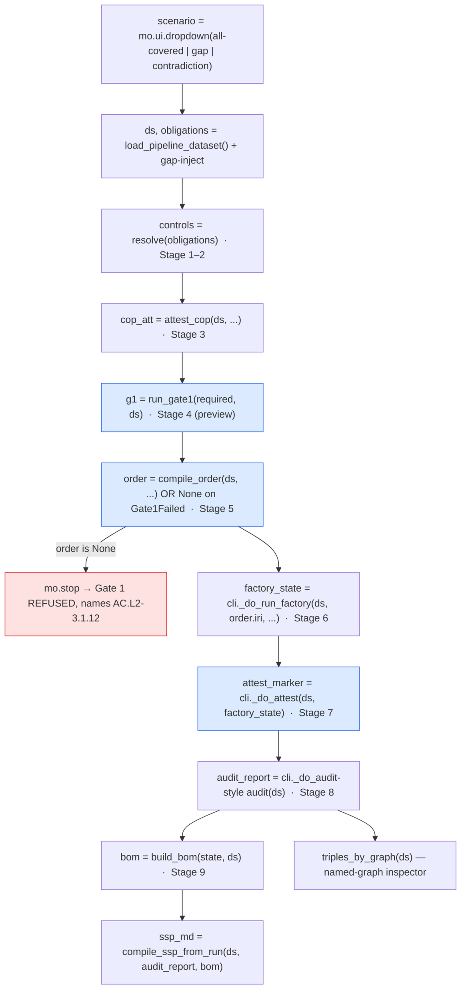

# feat: Marimo notebook — glass-walled walkthrough of the compliance engine

## Overview

Build a **reactive Marimo notebook** that is a live viewport onto the running compliance
engine. It walks the *same* chain `cli.py demo` runs — contract → obligations → controls →
COP → Gate 1 → Order → Factory → oracles → Gate 2 → audit/SPRS → BOM/SSP — but decomposed
cell-by-cell so a viewer *sees* each transformation: the real input, the real code path, and
the real output artifact at every stage. A single scenario selector (`all-covered` | `gap` |
`contradiction`) drives the entire notebook reactively, so one control replays all three
narratives — including watching **Gate 1 refuse** and the **R13 contradiction** surface.

This is not slides *about* the system. Each cell calls the identical functions `cli.py` calls
(imported, not reimplemented) and then illuminates the intermediate state pulled from the one
shared `rdflib.Dataset` threaded through the run.

---

## Problem Frame

The engine is real and tested (`cli.py demo` runs the full chain, 293 tests green), but its
value is invisible unless you read code or squint at terminal output. The team needs to
*demonstrate* — to a competent engineer or stakeholder who knows nothing about CMMC — exactly
what the system does at each step, with the domain jargon narrated inline. The two gates and
the verify-vs-validate line are the memorable beats; the honesty markers (mock /
NON-EVIDENTIARY, "4 machine-proven vs 18 human-attested") are the credibility beats. A
narrated, reactive notebook makes the mechanism legible and re-runnable on a laptop with
`uv run marimo edit`, no cloud and no credentials.

The audience framing and glossary come straight from `docs/v1/` (the ELI5 series) — the
notebook is the *executable* companion to that reading path.

---

## Requirements Trace

- R1. The notebook walks all nine stages in order, each showing real input → code path → real output (per the feature description's stage list 1–9).
- R2. A single `mo.ui.dropdown` scenario selector (`all-covered` | `gap` | `contradiction`) drives the whole notebook reactively; changing it replays the full chain.
- R3. Stages reuse the actual engine code paths (`cli.py` `_do_*` helpers + the underlying `order-compiler` / `pipeline` / `traceability` / `documents` modules), threading one shared `Dataset` exactly as `cli.py demo` does — no reimplementation of engine logic.
- R4. Gate 1 is shown as a first-class beat: forward / backward / testable checks visible, and the `gap` scenario makes Gate 1 **refuse and name the missing control** (`AC.L2-3.1.12`) with downstream stages visibly halted.
- R5. Gate 2 + audit is shown as the second beat: SPRS scorecard, the R13 contradiction (in the `contradiction` scenario), and the proven-vs-attested split.
- R6. Honesty markers are prominent: `evidentiary_status = "mock"`, the NON-EVIDENTIARY banner, and the machine-proven vs human-attested counts.
- R7. The `<ce:*>` named-graph substrate is made visible at least once (per-graph triple counts + a TriG peek), tying artifacts back to the RDF store.
- R8. Deterministic output: a fixed run seed (`RUN_SEED_TS`) yields identical hashes across runs, matching `cli.py`'s determinism guarantee.
- R9. Ships with run instructions (`notebook/README.md`) and a `marimo` dependency wired into `pyproject.toml`; a smoke test proves the notebook's engine layer runs for all three scenarios.

---

## Scope Boundaries

- **Not** a rewrite or refactor of any engine module. The notebook is read-mostly glue over existing code; if a stage needs a new *query* helper it goes in the notebook's adapter, never in the engine packages.
- **Not** the `--backend terraform` path. The notebook uses the default `FakeProvisionBackend` (no `terraform` binary required), matching the README's default demo. A short note may mention the terraform path exists; the notebook does not exercise it.
- **Not** a replacement for `docs/v1/` or `cli.py`. It complements them; the CLI remains the canonical operator entrypoint.
- **No** new evidence, controls, fixtures, or scenarios beyond the three existing evidence-sets.
- **No** live cloud, credentials, signing, or SPRS submission — all deferred exactly as in the engine today.

### Deferred to Follow-Up Work

- Deploying the notebook as a hosted read-only app (`marimo run` behind a URL, or WASM/`marimo export html`): a possible later step for sharing without a checkout. Called out in `notebook/README.md` but not built here.
- A guided "presenter mode" narrative script / speaker notes doc: separate follow-up if the team wants a scripted 5-minute walkthrough.

---

## Context & Research

### Relevant Code and Patterns

- `cli.py` (repo root) — **the definitive wiring reference.** Its `demo` command threads one shared `Dataset` through `_do_compile → _do_run_factory → _do_attest → _do_audit → _do_bom → _ssp_hook`. Importing `cli` also runs its `sys.path.insert(0, str(_ROOT / "order-compiler"))`, which makes `import compiler` / `cop` / `rule_library` work. Reuse: `cli.RUN_SEED_TS` (`"2026-07-02T00:00:00+00:00"`), `cli._GAP_CONTROL` (`"AC.L2-3.1.12"`), `cli.EVIDENCE_SETS`, and helpers `cli._do_run_factory`, `cli._do_attest`, `cli._do_audit`, `cli._do_bom`.
- `order-compiler/compiler.py` — `load_pipeline_dataset() -> (Dataset, dict[str, Obligation])` builds the fresh dataset (catalog→`<ce:ontology>`, tier1→`<ce:structural>`, COP→`<ce:order>`). `compile_order(ds, obligations, cop_attestation, *, now=...) -> Order` (fields `.order_hash`, `.required_controls`, `.included_modules`, `.iri`, `.gate1`). Raises `Gate1Failed` (`.report` is a `Gate1Report`). `resolve_required_controls(obligations, ...) -> (required_controls, markers)` for the pre-gate control set.
- `order-compiler/rule_library.py` — `Obligation` dataclass (`name, obligation_type, data_marker, source_ref, derives`); `resolve(obligation, *, catalog_path=None) -> ControlSet` (a `frozenset[str]` with `.markers`); type constant `DATA = "data"`; `load_obligations(ttl_path) -> dict[str, Obligation]`.
- `order-compiler/cop.py` — `attest_cop(ds, obligations, *, auto=False, now=...) -> COPAttestation` (fields `.mode`, `.outcome`, `.affirmations`, `.is_attested`). `auto=True` records `earl:semiAuto` (AI-assisted) vs `earl:manual`.
- `order-compiler/gate1.py` — `run_gate1(required: set[str], ds, *, included_modules=None) -> Gate1Report`. `Gate1Report`: `.forward/.backward/.untestable` (each a `DirectionResult` with `.passed/.checked_count/.failures`), `.forward_map`, `.verification_methods`, `.passed`, `.gap_controls()`, `.orphan_modules()`, `.paper_claim_modules()`, `.render()`.
- `pipeline/runner.py` — `run_factory(ds, order_iri, *, provision_backend, store_backend, evidence_set=..., now=..., run_preflight=True, output_dir=None) -> PipelineState`. `PipelineState` per-stage fields: `load_order, fetch, plan, policy_check, apply, evidence, oracles`, plus `halted/halted_at/failures` and `evidence_index: list[{iri,summary,controls}]`. A policy-check fail halts before Apply.
- `pipeline/dataset.py` — `create_dataset()`, `export_trig(ds, path)`, `graph_for(ds, layer)`, `triples_by_graph(ds) -> {graph_iri: count}`, `query_named_graph(ds, layer, sparql, **bindings)`.
- `ontology/prefixes.py` — named-graph IRIs `G_ONTOLOGY, G_PLAN, G_STRUCTURAL, G_ORDER, G_EVIDENCE, G_ATTESTATIONS, G_PLAN_EXECUTION, G_AUDIT`; `NAMED_GRAPHS` (layer→IRI); namespaces `CE, CMMC, EARL`.
- `traceability/attestation.py` — `request_attestation(ds, control_id, official_name, *, auto_attest=False, adequacy=..., sufficiency=..., outcome=OUTCOME_PASSED, oracle_outcome=None, override_justification=None, now=...) -> URIRef`; `STATUS_LABEL` (outcome IRI → `MET|NOT MET|N/A|PLANNED|CANT TELL`). `cli._do_attest` already wraps this for the full required set incl. the contradiction wiring.
- `traceability/audit.py` — `audit(ds, *, timestamp=...) -> AuditReport` (`.forward/.backward/.contradictions: list[ContradictionRow]/.proven: ProvenVsAttested/.sprs: SprsResult|None/.required_controls/.met_control_ids`). `render_report(report, "md"|"json")`, `emit_audit_graph(ds, report)`.
- `traceability/sprs.py` — `SprsResult(score, status, illegal_poam, unmet)` with `.valid_submission`; `status ∈ {Final, Conditional, Ineligible}`.
- `traceability/bom.py` — `build_bom(state, ds, contract_id="NV012") -> BOM`; `BOM` fields `.bom_hash, .evidentiary_status, .control_mapping (tuple[ControlMappingRow]), .attestations, .to_canonical_json(), .artifact_hashes()`. `store_bom(bom, registry, contract_id) -> bom_hash`. `cli._do_bom` wraps build+store+write.
- `documents/ssp.py` — `compile_ssp_from_run(ds, *, audit_report=None, bom=None, dataset_path=None) -> str` (byte-stable Markdown, R12 banner forced on any `mock`/`mock-plan` status).
- `evidence/generators/` — `MockConfigExportGenerator` (`ce:ConfigExport` per fixture JSON) and `MockPolicyCheckGenerator` (`ce:PolicyCheck`, PASS/FAIL from fixture summary) are what the runner's CollectEvidence stage uses; `EvidenceArtifact` carries `summary`, `controls`, `evidentiary_status="mock"`, `method`, `result`.
- `oracles/criteria.py` / `oracles/assertion.py` — `evaluate(summary, control_id) -> OracleResult(outcome ∈ passed|failed|cantTell)`; `emit_control_check_assertion(...)` maps the string to an `earl:outcome` IRI, always `earl:mode earl:automatic`, `ce:evaluatesAgainst` (never `ce:attests`).
- `fixtures/nv012/cop_draft.ttl` — the example contract's COP: `ce:COP-NV012` + `cmmc:Obligation` individuals (e.g. `OBL-NV012-IDENTITY` type `personnel` → `IA.L2-3.5.{2,3,4}`; `OBL-NV012-CRYPTO` type `data`/CUI → `SC.L2-3.13.{10,11,16}`). Union of derived controls = the 22 Tier-1-claimed controls.
- `docs/v1/06-glossary.md` — source of the inline plain-English definitions the notebook links/quotes.

### External References

- Marimo is a **reactive, pure-Python** notebook: file is `import marimo as mo` + `app = marimo.App()` + `@app.cell` functions; **cells pass state only via returned/defined variables**, variable names must be globally unique, and execution order is derived from variable references (not top-to-bottom position). Last expression of a cell renders as its output. Run with `marimo edit <file>` (author) / `marimo run <file>` (read-only app). Docs: <https://docs.marimo.io/getting_started/key_concepts/>, reactivity <https://docs.marimo.io/guides/reactivity/>.
- Display/layout primitives to use: `mo.md`, `mo.hstack`/`mo.vstack`, `mo.accordion`, `mo.ui.tabs`, `mo.ui.table`, `mo.stat`, `mo.callout`, `mo.mermaid`, `mo.plain_text`, `mo.center`, and `mo.stop(condition, output)` for gate-style conditional halts. Cheat sheet: <https://github.com/vrtnis/marimo-cheat-sheet>. DataFrames render natively; `mo.ui.table` for interactive rows.

### Institutional Learnings

- `docs/solutions/` was not found to contain a directly relevant prior learning for notebook/demo tooling. (If present at implementation time, check for any marimo or demo-harness notes.)

---

## Key Technical Decisions

- **Reuse `cli.py` by importing it.** The notebook's adapter does `import cli`, which (a) configures `sys.path` for the hyphenated `order-compiler` package and (b) exposes the exact `_do_*` helpers and constants the CLI uses. This guarantees the notebook is a true viewport onto the shipped code, not a fork. Rationale: satisfies R3 and prevents drift.
- **Front half at finer grain than `cli._do_compile`.** `_do_compile` bundles COP-attest + compile and swallows the gap into `_GapRefused`. For pedagogy the notebook calls the *underlying* functions directly at each sub-step — `rule_library.resolve`, `cop.attest_cop`, `gate1.run_gate1`, `compiler.compile_order` — which are the same functions `_do_compile`/`compile_order` call internally. `run_gate1` is invoked explicitly as a "gate preview" before `compile_order` runs it authoritatively (cheap, deterministic, honest). Rationale: R1/R4 require the intermediate steps to be *visible*; calling the real functions keeps it faithful.
- **Reactivity over a mutating pipeline: chain on stage-output variables.** The `rdflib.Dataset` is mutated in place across stages, but Marimo tracks *variable definitions*, not mutations. Each stage cell therefore **returns a new named variable** (`order`, `factory_state`, `attest_marker`, `audit_report`, `bom`, …) and each downstream cell **reads the previous stage's variable**, forcing correct sequencing despite in-place `ds` mutation. The scenario dropdown feeds the very first cell (fresh `Dataset` per scenario via `load_pipeline_dataset()`), so changing it cascades a clean rebuild with no stale state. Rationale: this is the load-bearing correctness property of the whole notebook (R2/R3).
- **Gate 1 refusal via `mo.stop`.** For the `gap` scenario, the compile cell catches `Gate1Failed`, sets `order = None`, and renders the refusal (naming `AC.L2-3.1.12`). Every downstream stage cell begins with `mo.stop(order is None, <refusal-echo>)` so the Factory and everything after it *visibly do not run*. Rationale: R4's "downstream halted" is shown, not described.
- **Thin adapter module `notebook/_engine.py`.** Holds the `sys.path`/`import cli` setup and a small set of instrumentation functions that run a stage and return render-ready plain data (dicts/lists), keeping notebook cells short and making the engine layer unit-testable independent of the UI. Rationale: R9 testability; keeps cells declarative.
- **Determinism via `cli.RUN_SEED_TS`.** All `now=` args thread the fixed seed; the notebook never calls `datetime.now()`. Rationale: R8; identical hashes across runs, and outputs match `docs/v1/05-try-it.md`.
- **Marimo as an opt-in dependency group.** Add `marimo` under a `[dependency-groups] notebook` group in `pyproject.toml`, not the core deps, so the engine's runtime footprint is unchanged. Install via `uv sync --group notebook`. Rationale: keeps `pyproject` core lean (scope boundary).
- **Default `FakeProvisionBackend` only.** No `terraform` binary dependency in the demo path. Rationale: scope boundary; runs anywhere.

---

## Open Questions

### Resolved During Planning

- *Reimplement stages or reuse engine code?* → Reuse via `import cli` + direct module calls for the front half (see Key Decisions).
- *How to keep a reactive notebook correct over an in-place-mutated Dataset?* → Chain cells on stage-output variables + fresh Dataset per scenario (see Key Decisions).
- *Where does marimo live in deps?* → `[dependency-groups] notebook` in `pyproject.toml`.
- *How is the `gap` control injected?* → Same as `cli._do_compile`: add `Obligation("OBL-DEMO-GAP", rl.DATA, derives=frozenset({cli._GAP_CONTROL}))` to the obligations dict for the `gap` scenario before resolve/compile.

### Deferred to Implementation

- Exact Marimo layout choices per cell (tabs vs accordion vs stacked stats) — settle while seeing rendered output; the plan fixes *what* each cell shows, not pixel layout.
- Whether the named-graph inspector (Part 8) uses `mo.ui.table` over a DataFrame or a plain `mo.md` table — decide on readability once real triple counts are in hand.
- Precise `marimo` version pin — pin to the latest stable at implementation time (`marimo>=0.9` floor; verify current in `uv`).
- Whether the smoke test drives `_engine.run_pipeline(...)` directly (preferred) or also shells `marimo export` — start with the direct-call test; add an export check only if cheap.

---

## Output Structure

    notebook/
      compliance_walkthrough.py   # the marimo notebook (pure Python, app = marimo.App())
      _engine.py                  # adapter: sys.path + import cli, per-stage instrumentation helpers
      README.md                   # how to run (uv run marimo edit / run), what each stage shows
    tests/
      test_notebook_smoke.py      # engine-layer smoke test across the 3 scenarios + notebook import
    pyproject.toml                # + [dependency-groups] notebook = ["marimo>=0.9"]

---

## High-Level Technical Design

> *This illustrates the intended approach and is directional guidance for review, not implementation specification. The implementing agent should treat it as context, not code to reproduce.*

**Reactive cell dependency graph** — the scenario dropdown is the single upstream source; every
stage cell defines one output variable that the next stage reads, so Marimo sequences the
in-place-mutated `Dataset` correctly. `gap` short-circuits at Gate 1 via `mo.stop`.

**Cell-to-stage mapping** (each row is one notebook cell or tight cell cluster):

| Cell | Stage | Shows (real artifact) | Primary engine call |
|---|---|---|---|
| Intro | — | title, one-line pitch, chain mermaid, glossary accordion | — |
| Scenario | — | the `mo.ui.dropdown` selector + what each scenario proves | — |
| Contract | 1 | `cop_draft.ttl` obligations table (type, data-marker, derives) | `rule_library.load_obligations` (via `load_pipeline_dataset`) |
| Mapping | 2 | obligation → required controls, union = 22 | `rule_library.resolve` |
| COP | 3 | attestation mode (semiAuto=AI-assisted), affirmations, "AI drafts / human attests" | `cop.attest_cop` |
| Gate 1 | 4 | forward/backward/testable pass counts; `gap` → REFUSED + named control | `gate1.run_gate1` |
| Order | 5 | order hash, required controls, included modules (hash-referenced) | `compiler.compile_order` |
| Factory | 6 | fetch-by-hash, plan resources, policy check, mock apply, evidence artifacts + hashes, oracle EARL outcomes | `cli._do_run_factory` → `PipelineState` |
| Gate 2 | 7 | per-control MET attestations; contradiction wiring | `cli._do_attest` |
| Audit/SPRS | 8 | SPRS `mo.stat`, R13 contradictions, proven-vs-attested split | `traceability.audit.audit` |
| BOM/SSP | 9 | BOM hash, `evidentiary_status=mock`, control-mapping table, registry, NON-EVIDENTIARY SSP preview | `build_bom` + `compile_ssp_from_run` |
| Substrate | — | `<ce:*>` per-graph triple counts + TriG peek; honesty panel | `dataset.triples_by_graph` |

---

## Implementation Units

- [ ] Part 1. **Scaffolding + engine adapter (`notebook/_engine.py`) + marimo dependency**

**Goal:** Create the `notebook/` package, wire `marimo` into `pyproject.toml`, and build the thin adapter that imports `cli`, sets up `sys.path`, and exposes per-stage instrumentation functions returning render-ready plain data. This is the feature-bearing, testable core the notebook cells sit on.

**Requirements:** R3, R8, R9

**Dependencies:** None

**Files:**
- Create: `notebook/_engine.py`
- Modify: `pyproject.toml` (add `[dependency-groups] notebook = ["marimo>=0.9"]`)
- Test: `tests/test_notebook_smoke.py`

**Approach:**
- `_engine.py` imports `cli` (which configures `sys.path` for `order-compiler` and exposes `RUN_SEED_TS`, `_GAP_CONTROL`, `EVIDENCE_SETS`, `_do_run_factory`, `_do_attest`, `_do_audit`, `_do_bom`).
- Provide granular front-half helpers that call the real functions: `build_dataset(scenario) -> (ds, obligations)` (wraps `compiler.load_pipeline_dataset`, injects the gap obligation when `scenario == "gap"`), `resolve_controls(obligations) -> {obl_name: sorted[controls]}`, `attest_cop_step(ds, obligations) -> COPAttestation`, `gate1_preview(required, ds, included_modules) -> Gate1Report`, `compile_step(ds, obligations, cop_att) -> Order | Gate1Failure`.
- Provide a single `run_pipeline(scenario) -> dict` that runs the whole chain and returns a structured record (`order`, `gate1`, `factory_state`, `audit_report`, `bom`, `ssp_md`, or a refusal marker) — used by the smoke test and available to the notebook for a "run everything" path. All `now=` args pass `cli.RUN_SEED_TS`.
- Return plain dicts/dataclasses (not Marimo objects) so the module is UI-free and testable.

**Patterns to follow:** `cli.py`'s `_do_*` helpers and `_do_compile`'s gap-injection (`obligations["OBL-DEMO-GAP"] = rl.Obligation("OBL-DEMO-GAP", rl.DATA, derives=frozenset({_GAP_CONTROL}))`); `cli.RUN_SEED_TS` determinism threading.

**Test scenarios:**
- Happy path — `run_pipeline("all-covered")`: order hash truthy, `len(required_controls) == 22`, `factory_state.oracles.outcomes` has 6 entries, `audit_report.sprs.score == 110`, `audit_report.sprs.status == "Final"`, `len(audit_report.contradictions) == 0`, `bom.evidentiary_status == "mock"`.
- Error/refusal path — `run_pipeline("gap")`: returns a refusal marker with `gate1.gap_controls() == ["AC.L2-3.1.12"]`, `order is None`, and no `factory_state`/`bom` (downstream not run).
- Contradiction path — `run_pipeline("contradiction")`: `len(audit_report.contradictions) == 1`, `audit_report.sprs.score == 110`, proven split is `3` machine / `19` human-only.
- Determinism — two `run_pipeline("all-covered")` calls produce identical `order.order_hash` and `bom.bom_hash`.
- Edge — unknown scenario string raises a clear `ValueError` (not an opaque KeyError).

**Verification:** `uv run --group notebook pytest tests/test_notebook_smoke.py` passes; `_engine.py` imports with no side effects beyond `sys.path` setup.

---

- [ ] Part 2. **Notebook spine: header, scenario selector, chain map, glossary**

**Goal:** Stand up `notebook/compliance_walkthrough.py` as a valid Marimo app with the reactive spine — intro cell, the `mo.ui.dropdown` scenario selector, a `mo.mermaid` map of the whole chain, and a collapsible glossary — plus the first data cell that builds a fresh `Dataset` from the selected scenario.

**Requirements:** R1, R2, R7 (setup), R8

**Dependencies:** Part 1

**Files:**
- Create: `notebook/compliance_walkthrough.py`

**Approach:**
- Standard Marimo layout: `import marimo as mo`, `app = marimo.App()`, `@app.cell` functions; final cell `if __name__ == "__main__": app.run()`.
- Intro cell: title, the one-line pitch ("building the environment and proving it's compliant are the same action"), a `mo.mermaid` of contract→…→BOM, and a `mo.accordion` glossary of the ~12 core terms (CUI, CMMC, control, COP, Order, module, evidence, oracle, attestation, Gate 1/2, BOM, SSP, NON-EVIDENTIARY) sourced from `docs/v1/06-glossary.md`.
- Scenario cell: `scenario = mo.ui.dropdown(options=list(cli.EVIDENCE_SETS), value="all-covered", label="Scenario")` + a `mo.callout` explaining what each proves.
- Dataset cell: `ds, obligations = _engine.build_dataset(scenario.value)` — defines `ds`, `obligations`; this is the single reactive root that rebuilds on scenario change.

**Patterns to follow:** Marimo key-concepts app structure; `docs/v1/README.md` reading-order framing for the intro copy.

**Test scenarios:** Test expectation: none — pure display/spine glue; correctness of the reactive root is covered by Part 1's `build_dataset` tests and Part 8's notebook-import smoke test.

**Verification:** `uv run --group notebook marimo edit notebook/compliance_walkthrough.py` opens; the dropdown renders; changing it re-runs the dataset cell without error.

---

- [ ] Part 3. **Stages 1–3: contract → obligations → controls → COP attestation**

**Goal:** Three narrated cells showing the raw contract obligations, their resolution to required controls, and the AI-drafts/human-attests COP step.

**Requirements:** R1, R3

**Dependencies:** Part 2

**Files:**
- Modify: `notebook/compliance_walkthrough.py`

**Approach:**
- Contract cell (Stage 1): render the `obligations` dict as a table (name, type, data-marker, `derives`), with a `mo.callout` naming the source file `fixtures/nv012/cop_draft.ttl` and explaining "a COP is the machine-readable statement of what this contract requires."
- Mapping cell (Stage 2): `controls_by_obl = _engine.resolve_controls(obligations)`; show obligation → controls and the deduped union count (22 for the base COP). Narrate `resolve()` and the CUI/ITAR spillover guard inline.
- COP cell (Stage 3): `cop_att = _engine.attest_cop_step(ds, obligations)`; show `.mode` (semiAuto = AI-assisted draft), `.outcome`, `.affirmations`, and a `mo.callout` on the founding line — "AI drafts the obligations; a Compliance Officer attests them." Define `cop_att` for downstream.

**Patterns to follow:** `cli._do_compile` (COP-attest then compile); glossary phrasing from `docs/v1/03-machine-vs-human.md`.

**Test scenarios:** Test expectation: none — display cells over Part 1-tested helpers (`resolve_controls`, `attest_cop_step`).

**Verification:** For `all-covered`, the mapping cell shows 22 unioned controls and the COP cell shows an attested (`passed`) COP.

---

- [ ] Part 4. **Stage 4–5: Gate 1 (the first beat) + the signed Order**

**Goal:** Make Gate 1 a first-class emotional beat — forward/backward/testable checks visible — and show the hash-referenced Order that only emerges when the gate passes. In the `gap` scenario, Gate 1 **refuses and names `AC.L2-3.1.12`**, and the Order cell visibly does not produce an Order.

**Requirements:** R1, R3, R4

**Dependencies:** Part 3

**Files:**
- Modify: `notebook/compliance_walkthrough.py`

**Approach:**
- Gate 1 cell (Stage 4): `g1 = _engine.gate1_preview(required, ds, included_modules)`; render `.forward/.backward/.untestable` pass counts as three `mo.stat`s, and when `not g1.passed` show `g1.gap_controls()` / `g1.orphan_modules()` / `g1.paper_claim_modules()` in a red `mo.callout`. Narrate the three checks in one line each.
- Order cell (Stage 5): `order = _engine.compile_step(ds, obligations, cop_att)`; on `Gate1Failed` set `order = None` and render the refusal (`Gate 1 REFUSED — Order NOT emitted. Missing module for: AC.L2-3.1.12`). On success show `order.order_hash`, `order.required_controls` count, and `order.included_modules` (module → content hash) as the "signed build order." Define `order` for downstream.
- Every later stage cell (Part 5–Part 7) opens with `mo.stop(order is None, <echo of the Gate-1 refusal>)`.

**Patterns to follow:** `cli._do_compile`'s `_GapRefused` handling and the CLI's refusal message copy; `docs/v1/01-the-order.md` for Gate-1 narration.

**Test scenarios:** Test expectation: none in the notebook — the refusal behavior is asserted in Part 1's `run_pipeline("gap")` test; these cells are display + `mo.stop` glue.

**Verification:** Switching the dropdown to `gap` turns the Gate 1 cell red, names `AC.L2-3.1.12`, and the Order + all downstream cells show their `mo.stop` refusal banner instead of running.

---

- [ ] Part 5. **Stage 6: the Factory — fetch → plan → policy → apply → evidence → oracles**

**Goal:** One cell (optionally split into sub-cells with `mo.ui.tabs`) that runs the Factory over the Order and renders every intermediate: modules fetched by hash, planned resources, the pre-apply policy check, the mock apply/state hash, the evidence artifacts with their hashes and summaries, and the oracle EARL outcomes (passed/failed/cantTell).

**Requirements:** R1, R3, R6

**Dependencies:** Part 4

**Files:**
- Modify: `notebook/compliance_walkthrough.py`

**Approach:**
- `factory_state = cli._do_run_factory(ds, order.iri, scenario.value, "fake", out_dir)` — where `out_dir` is a per-session temp dir (e.g. under the OS temp root; never the repo). Define `factory_state`.
- Render from `PipelineState`: `fetch.module_hashes` (module → hash), `plan.resource_ids` / `plan.plan_controls`, `policy_check.passed` + findings, `apply.state_hash` + `resource_count`, `evidence_index` (each `{iri, summary, controls}`) as an evidence table, and `oracles.outcomes` (control → EARL outcome) with a `mo.callout` that "6 machine checks; the rest ride on human attestation."
- Narrate the verify line: oracles `ce:evaluatesAgainst` and are `earl:automatic`; they never attest.
- Handle the halt path: if `factory_state.halted`, show the safety-valve message (e.g. non-US region) — informational; the three demo scenarios don't halt, but the branch is shown for completeness.

**Patterns to follow:** `cli._do_run_factory` + `cli.run_factory_cmd`'s state rendering; `docs/v1/02-the-factory.md`.

**Test scenarios:** Test expectation: none in the notebook — factory outputs (`6` oracle outcomes, `7` evidence nodes) are asserted in Part 1's happy-path test.

**Verification:** For `all-covered`, the cell shows 7 evidence artifacts, 6 oracle outcomes, and the module→hash / resource lists; no halt.

---

- [ ] Part 6. **Stage 7–8: Gate 2 attestation + audit / SPRS (the second beat)**

**Goal:** Show the human MET call for the full required set, then the bidirectional audit with the SPRS scorecard, the R13 contradiction (in the `contradiction` scenario, a human attests MET over a failed oracle), and the proven-vs-attested split.

**Requirements:** R1, R3, R5, R6

**Dependencies:** Part 5

**Files:**
- Modify: `notebook/compliance_walkthrough.py`

**Approach:**
- Attest cell (Stage 7): `attest_marker = cli._do_attest(ds, factory_state)` (returns the count). Show N controls attested MET by the "NV012 Affirming Official," and a `mo.callout` on the golden rule — only a human attestation makes a control MET (`earl:manual` / FCA liability). Define `attest_marker` for downstream sequencing.
- Audit cell (Stage 8): `audit_report = cli._do_audit(ds, out_dir)` (or `audit(ds, timestamp=cli.RUN_SEED_TS)` directly). Render: SPRS `mo.stat` (`score`, `status`, `valid_submission`), forward/backward pass, `audit_report.proven.summary()` (e.g. "4 MET-by-machine / 18 MET-by-human-only"), and `audit_report.contradictions` as a table. For `contradiction`, spotlight the one R13 row in a `mo.callout`: "a 110 here is NOT clean." Define `audit_report`.

**Patterns to follow:** `cli._do_attest` (incl. the `ce:oracleOutcome` wiring that makes R13 fire) and `cli._do_audit` / `_print_audit_summary`; `docs/v1/04-the-proof.md`.

**Test scenarios:** Test expectation: none in the notebook — SPRS score, contradiction count, and proven split are asserted in Part 1 across all three scenarios.

**Verification:** `all-covered` → SPRS 110/Final, 0 contradictions, 4/18 split; `contradiction` → SPRS 110/Final but 1 contradiction and 3/19 split, both surfaced.

---

- [ ] Part 7. **Stage 9: BOM + SSP + registry (the honesty close)**

**Goal:** Show the final proof artifacts: the content-addressed BOM (hash, `evidentiary_status="mock"`, control-mapping table), the write-once registry, and a preview of the deterministic SSP with its NON-EVIDENTIARY banner.

**Requirements:** R1, R3, R6

**Dependencies:** Part 6

**Files:**
- Modify: `notebook/compliance_walkthrough.py`

**Approach:**
- BOM cell: `bom = cli._do_bom(factory_state, ds, out_dir)`; show `bom.bom_hash`, `bom.evidentiary_status`, and `bom.control_mapping` as a table (control → resources → evidence hashes → oracle outcome → attestation outcome → status). Point at the registry dir (`objects/<hash>` + `index.json`) written under `out_dir`.
- SSP cell: `ssp_md = compile_ssp_from_run(ds, audit_report=audit_report, bom=bom, dataset_path=<out_dir>/engine.trig)`; render the top of `ssp_md` (the NON-EVIDENTIARY banner + colophon) via `mo.md`, and offer the full text in a `mo.accordion`. A `mo.callout` closes the honesty beat: mock evidence ⇒ not a submittable SSP.
- Define `bom`, `ssp_md`.

**Patterns to follow:** `cli._do_bom` + `cli._ssp_hook`; `docs/v1/05-try-it.md`'s "what lands in your output directory" table and "what's real vs pretend" section.

**Test scenarios:** Test expectation: none in the notebook — BOM hash/status determinism is asserted in Part 1; SSP banner presence is already covered by `tests/test_ssp.py` in the engine.

**Verification:** For `all-covered`, BOM shows `evidentiary_status=mock` and a full control-mapping; the SSP preview shows the NON-EVIDENTIARY banner.

---

- [ ] Part 8. **Substrate inspector + honesty panel + README + smoke test finalize**

**Goal:** Add the `<ce:*>` named-graph inspector (per-graph triple counts + a TriG peek) to make the RDF substrate legible, a closing "what's real vs mock" honesty panel, write `notebook/README.md`, and finalize the notebook-import smoke test.

**Requirements:** R6, R7, R9

**Dependencies:** Part 2 (spine), Part 6/Part 7 (populated graphs to inspect)

**Files:**
- Modify: `notebook/compliance_walkthrough.py`
- Create: `notebook/README.md`
- Modify: `tests/test_notebook_smoke.py`

**Approach:**
- Substrate cell: `counts = dataset.triples_by_graph(ds)` rendered as a table keyed by the eight `<ce:*>` graphs (ontology, plan, structural, order, evidence, attestations, plan-execution, audit), plus a short `mo.plain_text` peek of a few TriG lines (via `export_trig` to a temp path or an in-memory serialize) so viewers see the actual named-graph syntax. Narrate: "one queryable knowledge graph; every stage wrote its layer."
- Honesty panel: a closing `mo.callout` summarizing mock/NON-EVIDENTIARY, "4 of 22 machine-proven," and the deferred items (signing, live apply, IL5) — mirroring `docs/v1/05-try-it.md`.
- `notebook/README.md`: what the notebook is, `uv sync --group notebook`, `uv run marimo edit notebook/compliance_walkthrough.py` (author) vs `uv run marimo run …` (read-only), run-from-repo-root note, the three-scenario tour, and a pointer to the deferred hosted-app follow-up.
- Smoke test finalize: add a case asserting `import notebook.compliance_walkthrough` succeeds and exposes a `marimo.App` (the notebook file is valid Python and wires cells without error), complementing Part 1's `run_pipeline` cases.

**Patterns to follow:** `pipeline/dataset.py` inspection helpers; `ARCHITECTURE.md` §4 named-graph table for the layer descriptions; `docs/v1/05-try-it.md` honesty copy.

**Test scenarios:**
- Happy path — importing `notebook.compliance_walkthrough` returns a module exposing `app` as a `marimo.App` with no import-time exceptions.
- Integration — after a full `all-covered` run, `triples_by_graph(ds)` reports non-zero counts for `<ce:ontology>`, `<ce:structural>`, `<ce:order>`, `<ce:evidence>`, `<ce:attestations>`, `<ce:audit>` (proves each stage wrote its layer).

**Verification:** `uv run --group notebook pytest tests/test_notebook_smoke.py` green; `notebook/README.md` steps reproduce a working `marimo edit` session from a clean `uv sync --group notebook`.

---

## System-Wide Impact

- **Interaction graph:** The notebook and `_engine.py` are new leaf consumers; they import `cli` and engine packages read-mostly. Importing `cli` runs its module-level `sys.path.insert` and Typer app construction — harmless side effects. No engine module is modified, so no existing caller is affected.
- **Error propagation:** `Gate1Failed` is caught at the Order cell and turned into a `mo.stop` refusal; a Factory `halt` is rendered, not raised. `run_pipeline` surfaces an unknown-scenario `ValueError` early.
- **State lifecycle risks:** Each scenario change builds a **fresh** `Dataset`, so no stale RDF leaks between runs. Notebook artifacts (`engine.trig`, `bom.json`, `registry/`) write to a per-session temp dir, never the repo `output/` — avoids clobbering CLI runs and keeps the working tree clean.
- **API surface parity:** None changed. If a stage needs a read-only query helper, it lives in `notebook/_engine.py`, not the engine packages (scope boundary).
- **Integration coverage:** Part 1's `run_pipeline` tests exercise the real end-to-end chain per scenario (the cross-layer proof); Part 8's import test proves the notebook file itself is wired correctly.
- **Unchanged invariants:** `cli.py`, all `order-compiler` / `pipeline` / `traceability` / `documents` modules, fixtures, and the core `pyproject` dependencies are untouched. The only `pyproject` change is an additive opt-in `[dependency-groups] notebook`.

---

## Risks & Dependencies

| Risk | Mitigation |
|------|------------|
| Marimo's reactivity doesn't re-run a cell because `ds` is mutated in place (not redefined), showing stale artifacts | Chain every stage cell on the previous stage's **output variable** (`order`→`factory_state`→`attest_marker`→`audit_report`→`bom`); fresh `Dataset` per scenario. This is the central design property, verified by switching scenarios and watching all cells cascade. |
| Importing `cli` / hyphenated `order-compiler` fails from the `notebook/` cwd | `_engine.py` centralizes `sys.path` setup by importing `cli` (which does the insert); README instructs running `marimo` from repo root. |
| `marimo` version API drift (layout primitives move between versions) | Pin to a known-good version in the `notebook` group; stick to stable primitives (`mo.md/stat/callout/accordion/mermaid/ui.dropdown/ui.tabs/ui.table/stop`); verify on the installed version at implementation time. |
| Notebook writes clutter the repo `output/` or collide with CLI runs | Use a per-session temp `output_dir`; never default to repo `output/`. |
| Smoke test becomes brittle if it asserts on UI objects | Test the UI-free `_engine.run_pipeline` layer + a plain import check; do not assert on rendered Marimo widgets. |
| Scenario re-runs feel slow if the chain is heavy | The full chain is seconds-scale and deterministic; acceptable. If needed, `mo` lazy/`@app.cell(disabled=…)` or an explicit "run" button can gate the expensive stages — deferred unless observed. |

---

## Documentation / Operational Notes

- `notebook/README.md` is the run runbook (install group, edit vs run, repo-root note, three-scenario tour).
- Consider a one-line pointer from the top-level `README.md` ("Prefer an interactive tour? See `notebook/`") — small, optional, additive; can land with Part 8 or as a follow-up.
- No CI change required to ship; if desired later, the smoke test runs under the existing `pytest` config (it will need the `notebook` group installed in CI).

---

## Sources & References

- Definitive wiring reference: `cli.py` (repo root) — the `demo` chain and `_do_*` helpers.
- Engine API surface (signatures) extracted from: `order-compiler/{compiler,rule_library,cop,gate1}.py`, `pipeline/{runner,dataset}.py`, `ontology/prefixes.py`, `traceability/{attestation,audit,sprs,bom}.py`, `documents/ssp.py`, `evidence/generators/*`, `oracles/{criteria,assertion}.py`, `fixtures/nv012/cop_draft.ttl`.
- Newcomer narration source: `docs/v1/00`–`06` (ELI5 series + glossary), `ARCHITECTURE.md` §4 (named-graph table).
- Marimo docs: <https://docs.marimo.io/getting_started/key_concepts/>, <https://docs.marimo.io/guides/reactivity/>; cheat sheet <https://github.com/vrtnis/marimo-cheat-sheet>.
